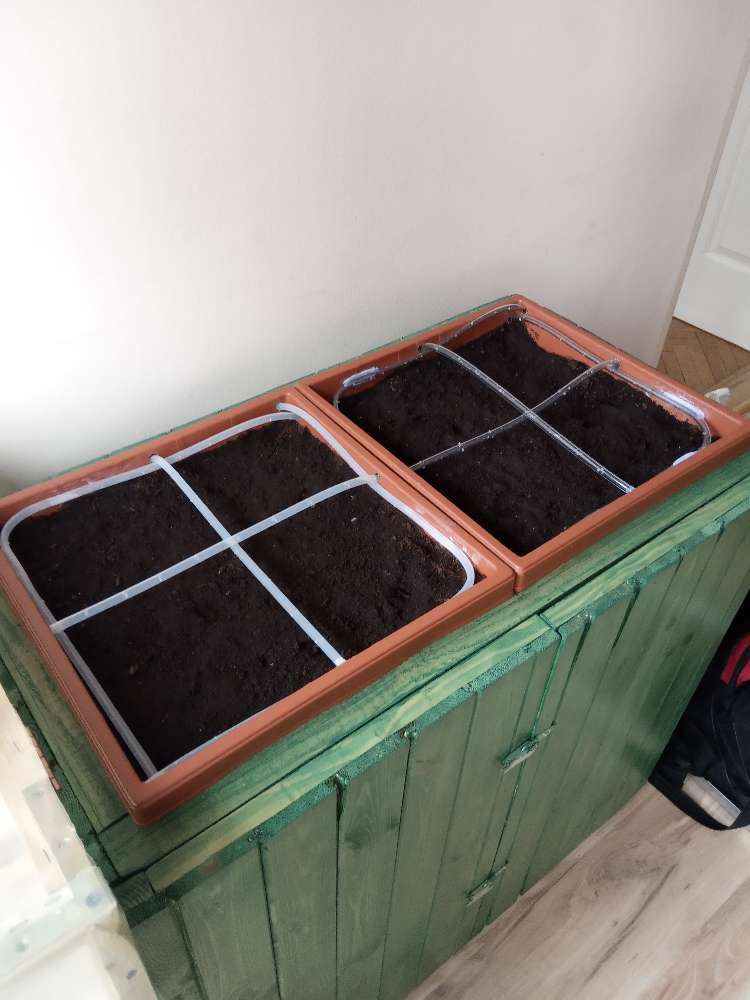

# Greenhouse

WORK IN PROGRESS

Project of greenhouse containing PCB project, software, photos and other files.
User can plant plants in two pots (each pot got 4 sections), monitor temperature in the greenhouse, soil moisture, irigate sections (manually or automatically). Everything will be displayed on a digital display can be controlled by a keyboard.

Construction of the lower part of the greenhouse (cupboards for pots and water tanks) with irrigation lines:

Structure of the upper part (glazed) with doors:

Full greenhouse construction with planted plants:

  

